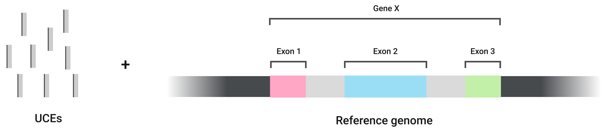
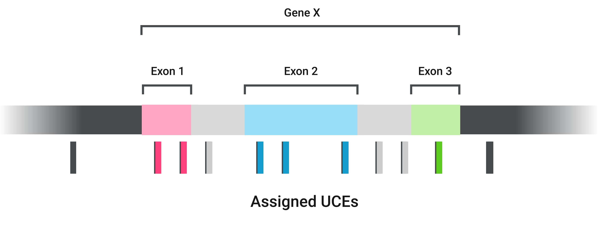
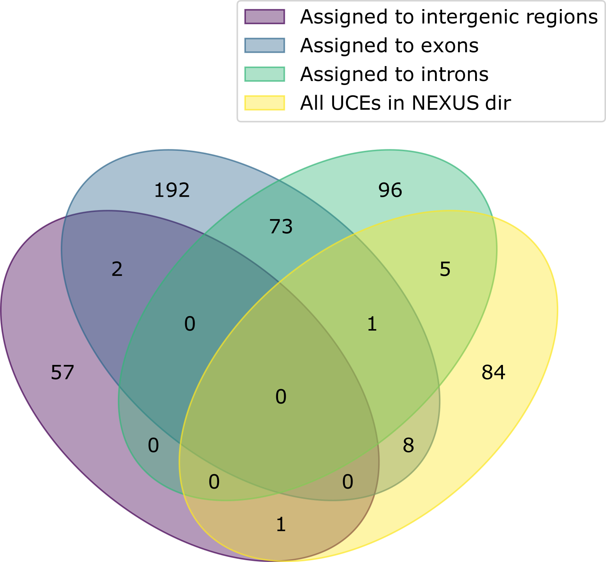

<p align="center"></p>


# Table of contents

- [**Introduction**](#introduction)
  * [Curing based on the genes the UCEs are located](#curing-based-on-the-genes-the-uces-are-located)
  * [Curing based on the internal UCE regions](#curing-based-on-the-internal-uce-regions)
- [**Installation**](#installation)
- [**How CURE works**](#how-cure-works)
  * [GeneRegion Strategy](#generegion-strategy)
  * [UCERegion Strategy](#uceregion-strategy)
- [**Quick usage examples**](#quick-usage-examples)
  * [Running the test dataset for the GeneRegion strategy](#running-the-test-dataset-for-the-generegion-strategy)
    + [Running only one of the concatenating approaches of the GeneRegion strategy](#running-only-one-of-the-concatenating-approaches-of-the-generegion-strategy)
      - [Only by gene](#only-by-gene)
      - [Only by genic region](#only-by-genic-region)
  * [Running the test dataset for the UCERegion strategy](#running-the-test-dataset-for-the-uceregion-strategy)
- [**Output files**](#output-files)
  * [Output files of UCERegion strategy](#output-files-of-uceregion-strategy)
  * [Output files of GeneRegion strategy](#output-files-of-generegion-strategy)
  * [Summary files](#summary-files)
- [**Estimating trees from output files**](#estimating-trees-from-output-files)
  * [Estimating trees for alignments from external sources](#estimating-trees-for-alignments-from-external-sources)
- [**Citation**](#citation)
- [**License**](#license)

# Introduction

**CURE** is an automated and parallel pipeline for the **C**uration of **U**ltraconse**R**ved **E**lements (UCEs) for species-tree reconstruction. It is an automation/adaptation of the strategies proposed by [Van Dam et al. 2021](https://academic.oup.com/sysbio/article/70/2/307/5880562#227740768) (named **GeneRegion** strategy), and [Freitas et al. 2021](https://academic.oup.com/mbe/article/38/3/1090/5976982) (name **UCERegion** strategy).

## Curing based on the genes the UCEs are located

In the **GeneRegion** strategy (Van Dam et al. 2021), **CURE** performs the curing process based on the genes in which each UCE is located. **CURE** can do it in two different ways:

* _by gene_: concatenates all UCEs from the same gene and treats different genic regions (exons and introns) as different partitions;
* _by genic region_: concatenates all UCEs from the same exons or introns of the same gene.

When using the **GeneRegion** strategy, the default behavior of **CURE** is to run these two ways but this can be changed. The input files for the **GeneRegion** pipeline are the baits file used for UCE sequencing, the reference genome, an annotation file, and the UCE alignments produced by [phyluce](https://phyluce.readthedocs.io/en/latest/).

## Curing based on the internal UCE regions

In the **UCERegion** strategy (Freitas et al. 2021), **CURE** performs the curing process based on the internal regions of each UCE (right flank, core, and left flank). It runs SWSC-EN ([Tagliacollo & Lanfear 2018](https://academic.oup.com/mbe/article-abstract/35/7/1798/4969532)) in parallel to speed up the process and creates charsets considering the left flank, core, and right flank as different partitions for each locus in the dataset.

# Installation

We recommend the installation of **CURE** with [conda](https://conda.io/) for the automatic installation of all dependencies.
First, clone this repo in your local machine and enter the created directory:

```
git clone https://github.com/vhfsantos/CURE.git
cd CURE
```
Then, create a conda environment for **CURE** using the `cure.yml`, and ensure all scripts have execution permission:

```
conda env create -n cure --file misc/cure.yml
chmod +x CURE
chmod +x scripts/*
```

After done all installations, activate the CURE environment and run **CURE** with no arguments. **CURE** will tell you if any dependencies are missing.

```
conda activate cure
./CURE
```

# How CURE works

## **GeneRegion** Strategy

The main inputs for this strategy are the UCE alignments and an annotated reference genome (note that **CURE** also needs to be provided with the baits file used for the UCE sequencing)

<p align="center"></p>

The first step of **CURE** is running a custom version of the `uce_type` tool described by [Van Dam et al. 2021](https://academic.oup.com/sysbio/article/70/2/307/5880562#227740768) and available at the [Cal Academy's repository](https://github.com/calacademy-research/ccgutils).
Briefly, this step assigns each UCE to an exon, intron, or intergenic region of the given reference genome

<p align="center"></p>

Then **CURE** parses the results and merges the UCEs in two different ways: by gene and by region.

When concatenating *by gene*, **CURE** merges all UCEs from the same gene and treats different regions (exons and introns) as different partitions (Note that different introns are placed under the same partition). It stores the results in `phylip` format inside the `concatenated_by_gene/` directory.
Further phylogenetic analysis of UCEs merged with this approach would yield a phylogenetic tree for each gene.

<p align="center"></p>

When concatenating *by genic region*, **CURE** merges only UCEs from the region of the same gene.
It stores the results in `nexus` format inside the `concatenated_by_genic_region/` directory.
Further phylogenetic analysis of UCEs merged with this approach would yield several phylogenetic trees, one originating from each region.

<p align="center"></p>

For any of the two concatenating approaches, **CURE** leaves unmerged UCEs in intergenic regions.
These UCEs are just copied to the `intergenic_regions/` directory.

<p align="center"></p>


## **UCERegion** Strategy

For this strategy, you need to provide a folder with all the individual alignments you want to use, in `nexus` format (could be all your alignments or a subset).
You need to have [SWSC-EN](https://github.com/Tagliacollo/PFinderUCE-SWSC-EN) included in your `PATH` variable, otherwise, you should pass the path to the `SWSCEN.py` script to the `--swsc` parameter.
What **CURE** does is run the `SWSC-EN` in parallel and use `PHYLUCE` to split the alignments according to regions identified by SWSC.
Then, **CURE** re-concatenates them, creating a charset file to be used in phylogenetic analyses to generate your gene trees, treating each UCE region (left flank, core, and right flank) as different partitions. 

> Note that we provide the `./scripts/estimate-trees.sh` script for this last step. It automatically runs IQ-Tree in parallel, for a fast estimation of the gene trees using the output alignment files.

# Quick usage examples

## Running the test dataset for the **GeneRegion** strategy

You can test **CURE** with the test dataset.
It usually takes about two minutes to run with 10 threads.
With the command line below, **CURE** will run the **GeneRegion** strategy, concatenating both _by gene_ and _by genic region_.

```sh
CURE GeneRegion --baits test_data/baits.fasta  \
                --reference test_data/ref.fa \
                --gff test_data/ref.gff \
                --phyluce-nexus test_data/uce_nexus/ \
                --output ./CURE-GeneRegion-output
```

### Running only one of the concatenating approaches of the **GeneRegion** strategy

By default, **CURE** runs the **GeneRegion** strategy with both concatenating approaches( _by gene_ and _by genic region_).
However, you can raise the `--only-by-gene` or `--only-by-genic-region` flag to select only a single approach

#### Only by gene

```sh
CURE GeneRegion --baits test_data/baits.fasta  \
                --reference test_data/ref.fa \
                --gff test_data/ref.gff \
                --phyluce-nexus test_data/uce_nexus/ \
                --output ./CURE-GeneRegion-output \
                --only-by-gene
```

#### Only by genic region

```sh
CURE GeneRegion --baits test_data/baits.fasta  \
                --reference test_data/ref.fa \
                --gff test_data/ref.gff \
                --phyluce-nexus test_data/uce_nexus/ \
                --output ./CURE-GeneRegion-output \
                --only-by-genic-region
```


## Running the test dataset for the **UCERegion** strategy

To run the test dataset for the **UCERegion** strategy, use the following command line:

```sh
CURE UCERegion  --phyluce-nexus test_data/uce_nexus/ \
                --output ./CURE-UCERegion-output
```

The above command should raise an error if the `SWSCEN.py` script is not in your `$PATH` variable.
If this is your case, you can either add the script to the `$PATH` or pass the path for it in the `--swsc` parameter.

# Output files

The main output files produced by **CURE** are the alignments of concatenated and cured UCEs. Each of the two strategies, however, produces different output files.

## Output files of **UCERegion** strategy

**CURE** UCERegion generates three output subdirectories:

* logfiles: stores all the log files generated in the analysis
* partitioned-uces: stores all the alignments and their respective charsets files
* PF2-input: stores the input file for a putative downstream analysis with PartitionFinder2

## Output files of **GeneRegion** strategy

If you run the **GeneRegion** strategy without `--only-by-gene` or `--only-by-genic-region`, both of the concatenating approaches will be done.
In this case, your output-dir will contain `concatenated-by-gene/` and `concatenated-by-genic-region/` dirs.
If you raised any of these flags, only the corresponding dir will be created.

Besides, the **GeneRegion** strategy creates the `intergenic-regions/` dir containing unmerged UCEs assigned to intergenic regions.

Alignments in `concatenated-by-region/` and `intergenic-regions/` dir are in NEXUS format.
Alignments in `concatenated-by-gene/` are in PHYLIP format, and its charsets are in NEXUS format.

> To avoid troubles with further phylogenetic analysis, **CURE** replaces "-" with "_" in the gene and exon ID.

Secondary outputs of this strategy include `CURE-exons.txt`, `CURE-introns.txt`, and `CURE-intergenic.txt`, which contains the names of UCEs assigned to each genic region, as well as the region ID (for exons) and gene ID (for exons and introns).
The `CURE-intergenic.txt` file contains only the UCE names.

## Summary files

**CURE** outputs the `CURE_stats.csv` and `CURE_stats.pdf` files summarizing the total number of UCEs assigned to each region. 
This information is stored in a table-like format in the `.csv` file and depicted in a Venn diagram in the `.pdf` file. 

The Venn diagram summarizing the test data looks like this: 

<p align="center"></p>

The "**All UCEs**" group represents the UCEs present in the NEXUS dir (`--phyluce-nexus` argument).
Numbers outside this yellow ellipse represent the UCEs present in the baits file that were not present in the `--phyluce-nexus` directory (probably because they were not recovered upstream, by PHYLUCE)
We called this group "All UCEs" because it represents all the UCEs **CURE** works with. 

Note that **CURE** accounts for exons the UCEs assigned to both exon and intron (1, in this test data).
Also, it accounts for intergenic regions the unassigned UCEs (84, in this test data).

**CURE** also maintains in the output directory the files produces by the uce_kit pipeline (`uce_kit_output/` dir)

# Estimating trees from output files

**CURE** provides the wrapper script `estimate-trees.sh` for the estimation of gene trees from the output alignments with [IQ-tree](http://www.iqtree.org/), and further summary analysis with [ASTRAL](https://github.com/smirarab/ASTRAL).
This script runs IQ-tree in parallel using [GNU Parallel](https://www.gnu.org/software/parallel/) following the structure of the **CURE** output-dir.
Then it prepares all inputs needed for a summary analysis with ASTRAL.

For instance, if you run **CURE** setting `CURE-GeneRegion-output` as the output directory for the **GeneRegion** strategy, and `CURE-UCERegion-output` for the **UCERegion** strategy, you can call `estimate-trees.sh` as the following:

```sh
scripts/estimate-trees.sh \
        --gene-region-out CURE-GeneRegion-output \
        --uce-region-out CURE-UCERegion-output \
        --estimated-trees estimated-trees
```

If you run the **GeneRegion** strategy with `--only-by-gene` or `--only-by-genic-region` flags, you can raise it here as well:

```sh
scripts/estimate-trees.sh \
        --gene-region-out CURE-GeneRegion-output \
        --uce-region-out CURE-UCERegion-output \
        --estimated-trees estimated-trees \
        --only-by-gene
```

or

```sh
scripts/estimate-trees.sh \
        --gene-region-out CURE-GeneRegion-output \
        --uce-region-out CURE-UCERegion-output \
        --estimated-trees estimated-trees \
        --only-by-genic-region
```

> Note that you don't need to use both `--gene-region-out` and `--uce-region-out`. If you run **CURE** with only one of the strategies, you only need to use the appropriate parameter.

## Estimating trees for alignments from external sources

Moreover, `estimate-trees.sh` can be used to estimate trees from alignments from any other source; not necessarily those produced by **CURE**.
In this case, you only need to use the parameter `--custom-alignments` instead of `--gene-region-out` or `--uce-region-out`.
So if you have a set of alignments (in Phylip, Fasta, or Nexus format) in a directory called `input-alignments`, and want to run IQ-tree on them, you can call `estimate-trees.sh` as the following:

```sh
scripts/estimate-trees.sh \
    --custom-alignments input-alignments/ \
    --estimated-trees estimated-trees
```

# Citation

If you use **CURE** in your research, please cite:

Felipe V. Freitas, Michael G. Branstetter, Vinicius H. Franceschini-Santos, Achik Dorchin, Karen Wright, Margarita Lopez-Uribe, Terry Griswold, Fernando A. Silveira, Eduardo A. B. Almeida, (xxxx). UCE phylogenomics, biogeography, and classification of long-horned bees (Hymenoptera: Apidae: Eucerini), with insights on using specimens with extremely degraded DNA. In prep.

# License

[GNU General Public License, version 3](https://www.gnu.org/licenses/gpl-3.0.html)
